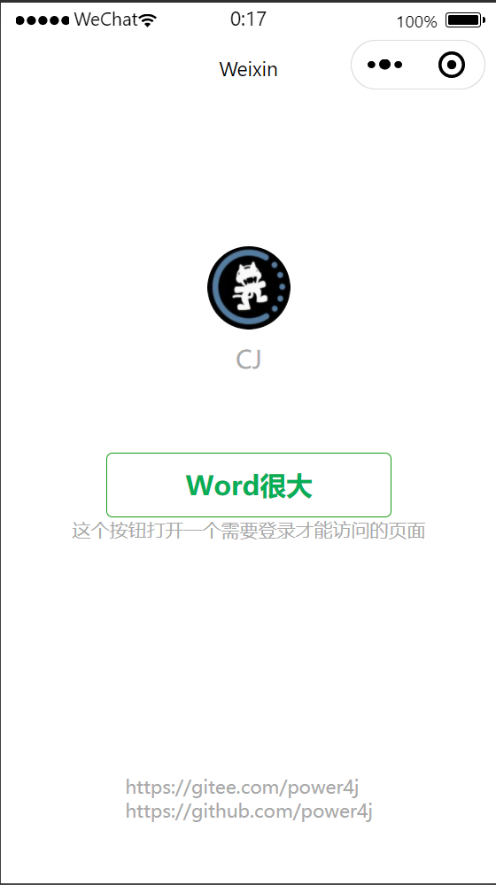

# 微信小程序用户登录演示

此项目演示小程序用户与后台用户的绑定、登录、业务API请求。

界面很丑，编码也很low,仅作为演示。欢迎有前端技术能力的大神PR！

# 流程

- 用户先在PC端查看自己的小程序绑定二维码
- 用户使用微信扫码该二维码，进入小程序账号绑定页面
- 点击绑定后完成移动端(微信)用户为后台用户的绑定
- 用户在小程序登录页面选择登录即可用微信账号登录后台系统
- 登录后重定向到用户个人信息页面，该页面显示当前用户的信息

## 相关功能截图

